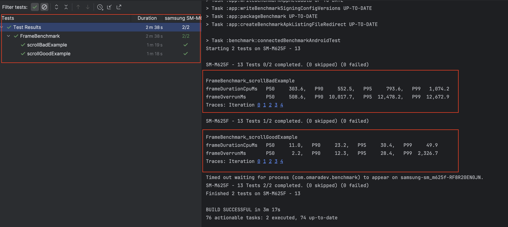

# 📊 Macrobenchmark Benchmark Results

## 🚀 App Startup Time (All Types)

---

## 🎬 Frame Rendering Benchmark

---

## 🎬 Trace Section Benchmark

# Microbenchmark 

This module contains **Microbenchmarks** for measuring the performance of small, isolated parts of the project, such as:
- Business logic (`domain/usecase`)
- Data models (`domain/model`)
- Repository operations (`data/repository`)
- JSON serialization/deserialization (`data/remote`)

Microbenchmarks help ensure that your domain and data layers remain efficient as the project grows.
